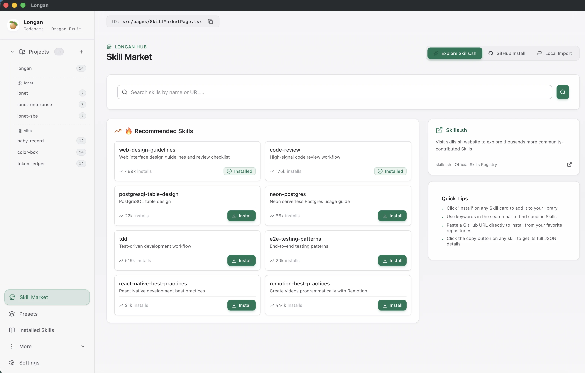
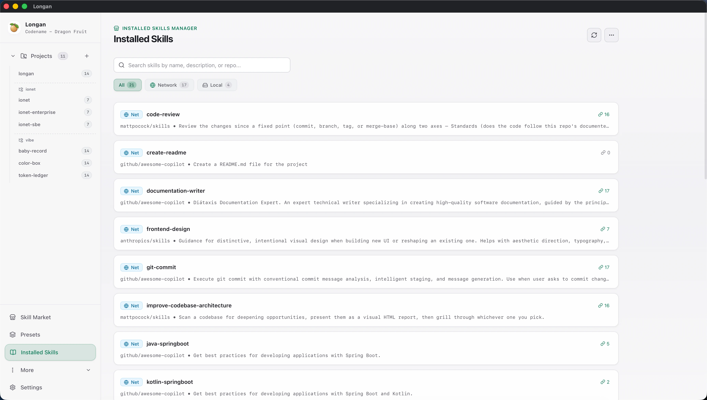
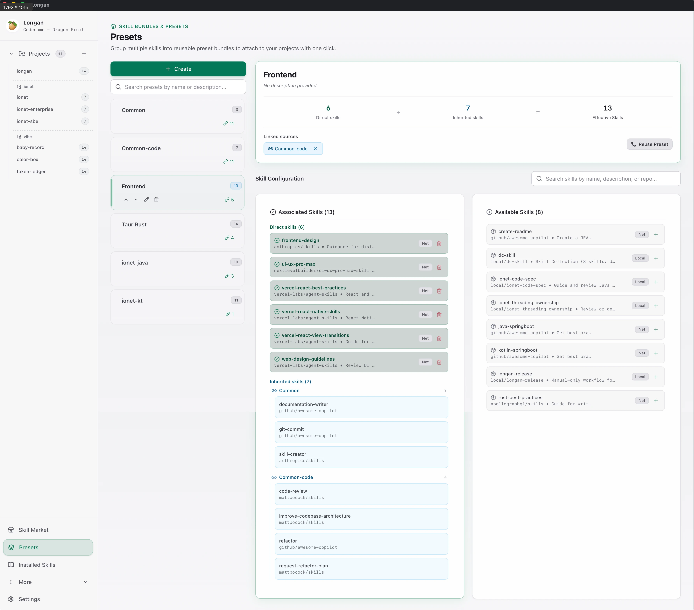

  

<h1 align="center">Longan</h1>

  A desktop tool for centrally managing and distributing AI Agent Skills. Discover, install, and reuse Skills with ease, and seamlessly link them to local projects and Agent directories through symbolic links.

  English | <a href="README_CN.md">中文</a>

## Introduction

In daily AI-assisted development, AI Agents such as Claude and Cursor rely on a rich set of Skills to extend their specialist capabilities. When skill files are scattered across individual code projects, they are easily downloaded repeatedly, fall out of version sync, and become harder to manage across projects.

Longan solves this problem with a one-stop experience for centralized skill storage and intelligent distribution:

- Single storage location, shared across projects: Install each Skill once and store it locally in one place. Longan synchronizes it to every code repository through symbolic links, avoiding redundant copies and file conflicts.
- Default standard directory: Every project's active Skills are synchronized to `.agents/skills`, the open Agent Skills standard directory. Agents that support the standard can discover and use them without additional configuration.
- Zero intrusion and intelligent synchronization: Automatically calculates incremental changes, including links to add or remove, and can add synchronized directories to `.gitignore` with one click to avoid version-control conflicts. Built-in broken-link detection and one-click repair keep project environments clean and ready to use.
- Multi-project and Agent directory binding: Organize projects through groups and sidebar navigation. In addition to the default `.agents/skills`, configure Agent-specific directories, such as `.claude/skills`, to apply globally or only to selected projects.

---

## Download and Installation

1. Open the [latest release](https://github.com/iohao/longan/releases/latest).
2. Download the installer for your system:
   - macOS: Choose the `macos-arm64` `.dmg` for Apple silicon or the `macos-x64` `.dmg` for Intel processors.
   - Windows: Download the `windows-x64` `.exe` or `.msi` installer.
   - Linux x64: Download the `linux-x64` `.AppImage`, `.deb`, or `.rpm` package.
3. Open the downloaded installer, follow your system prompts to finish installation, then launch Longan.

---

## Skill Marketplace

An intuitive skill discovery hub that removes the friction from finding and exploring Skills:

- Multi-source discovery and precise search: Integrates the official skills.sh registry to recommend high-quality community Agent Skills in real time. Search quickly by keyword, such as "react-query" or "tailwind", or by URL.
- Flexible skill sources: In addition to the official registry, paste a GitHub repository address, either in `owner/repo` format or as a full URL, to fetch it directly. You can also import a local folder containing `SKILL.md`.
- Asynchronous queue and installation tracking: Background tasks concurrently download, extract, and write Skills. Progress is displayed for every stage, with options to retry, cancel, or clear tasks at any time.

---

## Installed Skills

A comprehensive management and maintenance center for installed Skill assets:

- Full local asset overview and quick filtering: View every installed Skill in one place. Filter by All, Network, or Local, and search by keyword to clearly track each Skill's source and status.
- Version checks and one-click batch upgrades: Automatically detects updates to network Skills and supports one-click batch upgrades, keeping every Skill up to date.
- Reference dependency tracing: Precisely analyzes and displays each Skill's references, making it clear which Presets or code projects use it.
- Local refresh and safe cleanup: Rescan local skill directories at any time. When uninstalling a Skill, Longan shows related impacts and safely moves it to a recycle directory to prevent accidental deletion.

---

## Presets

For complex engineering projects, scattered Skills can be difficult to reuse consistently. Longan introduces Presets:

- Modular skill bundles: Package multiple frequently used or scenario-specific Skills into a Preset, such as a frontend toolkit or Rust standards collection, for modular skill management.
- Flexible inheritance and layered composition: Presets can reference one another and be nested. When a base Preset changes, all dependent higher-level combinations are updated automatically.
- One-click project binding and batch application: Associate a Preset with a target project to synchronize every effective Skill in that combination at once, greatly simplifying setup for new projects.

---

## Typical Use Cases

- Teams that want consistent configurations and standards for internal AI assistants
- Individual developers who want to maintain a consistent collection of Skills and workflows across multiple devices
- Exploring new open-source tools and quickly validating them in local projects
- Organizing scattered tools into a clear, reusable, layered skill system
- Rapidly adjusting the AI Skills used by a codebase when switching technology stacks or projects
