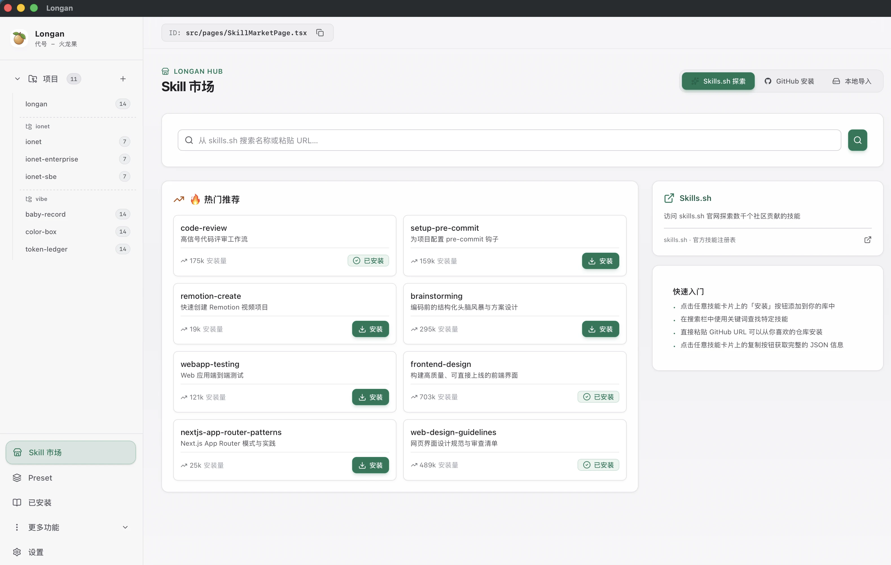
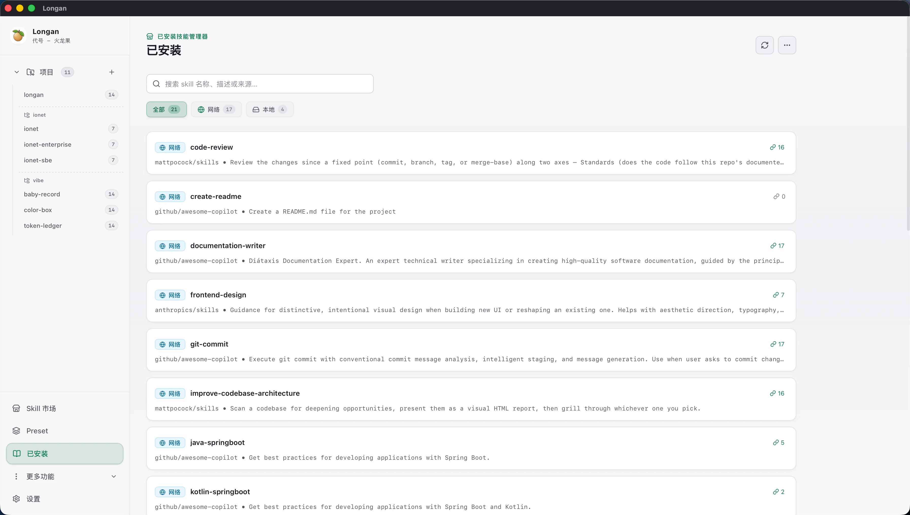
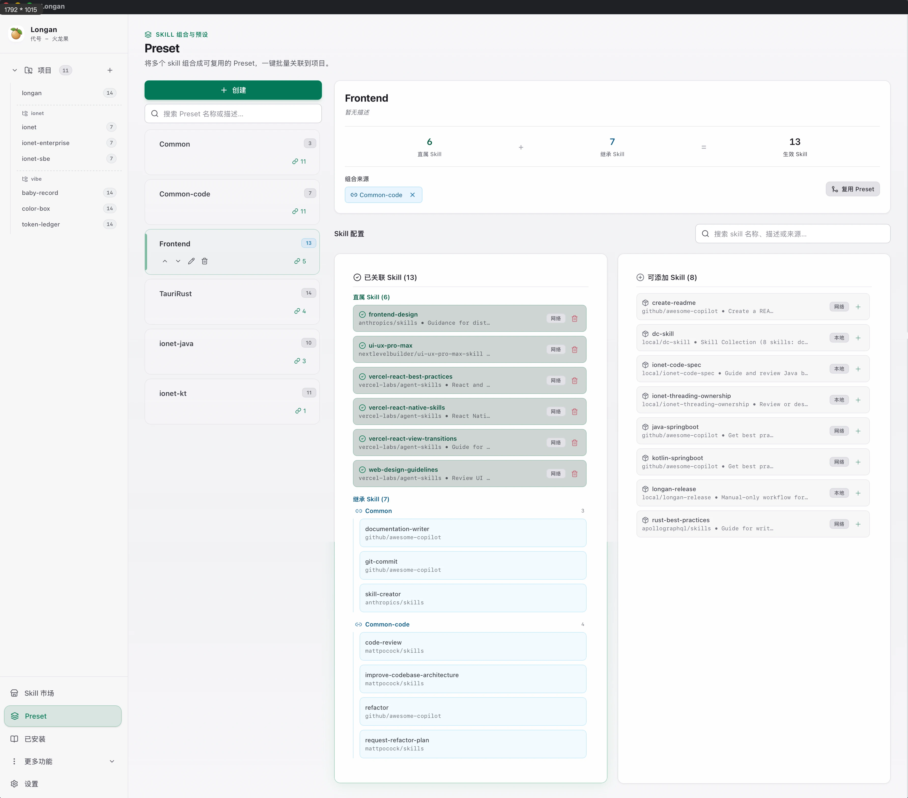

  

<h1 align="center">Longan</h1>

  面向 AI Agent Skill 的集中管理与分发桌面工具。轻松探索、安装与复用 Skill，并通过软链接无缝绑定至本地项目与 Agent 目录。

  中文 | <a href="README.md">English</a>

## 介绍

在 AI 辅助开发的日常中，各类 AI Agent（如 Claude、Cursor 等）依赖丰富的 Skill 来扩展专业能力。然而，技能文件散落在各个代码项目中，不仅容易导致重复下载与版本脱节，也增加了跨项目管理的复杂度。

Longan 致力于解决这一痛点，提供了一站式的技能集中存储与智能分发体验：

- 单点存储，多项目共享：所有 Skill 只需安装一次，集中存储于本地，并通过软链接（Symlink）无缝同步至各个代码仓库，避免冗余拷贝与文件冲突。
- 默认标准目录：每个项目的生效 Skill 都会同步至 `.agents/skills`，这是 Agent Skills 开放标准目录；无需额外配置即可供支持该标准的 Agent 发现和使用。
- 零侵入与智能同步：自动计算增量变更（新增或移除的链接），并支持将同步目录一键加入 `.gitignore`，避免版本控制冲突。内置坏链检测与一键修复功能，确保项目环境始终干净可用。
- 多项目与 Agent 目录绑定：支持项目分组与侧边栏导航管理。除默认的 `.agents/skills` 外，还可配置 `.claude/skills` 等 Agent 专有目录，并灵活设置为全局生效或针对指定项目生效。

---

## 下载与安装

1. 打开 [最新发布版本](https://github.com/iohao/longan/releases/latest)。
2. 根据系统下载对应安装包：
   - macOS：Apple 芯片选择 `macos-arm64`，Intel 芯片选择 `macos-x64` 的 `.dmg` 文件。
   - Windows：下载 `windows-x64` 的 `.exe` 或 `.msi` 安装包。
   - Linux x64：下载 `linux-x64` 的 `.AppImage`、`.deb` 或 `.rpm` 安装包。
3. 打开下载的安装包，按系统提示完成安装后启动 Longan。

---

## Skill 市场

内置直观便捷的技能探索中心，打破技能寻找与发现的门槛：

- 多渠道探索与精准检索：集成 skills.sh 官方注册表，实时推荐社区优质 Agent Skill。支持通过关键词（如 "react-query"、"tailwind"）或 URL 快速检索。
- 灵活拓展技能来源：除了官方注册表，还支持直接粘贴 GitHub 仓库地址（支持 owner/repo 格式或完整链接）拉取，或选择本地包含 SKILL.md 的文件夹直接导入。
- 异步队列与安装追踪：后台多任务并行处理下载、解压与写入，完整展示各个阶段进度，支持随时重试、取消或清除任务。

---

## 已安装

提供全方位的已安装技能资产管理与维护中心：

- 本地资产全景与快速筛选：集中展示所有已安装的 Skill，支持按“全部”、“网络”、“本地”分类过滤及关键字快速检索，清晰掌握技能来源与状态。
- 版本检测与一键批量升级：自动检测网络技能的版本更新，支持一键批量升级，让你的所有技能时刻保持最新。
- 引用依赖追溯：精准分析并展示任意技能的引用关系，清晰了解某个 Skill 正在被哪些 Preset 或代码项目所使用。
- 本地刷新与安全清理：支持重新扫描本地技能目录；卸载技能时自动提示关联影响并安全移至回收目录，防止误删。

---

## Preset

面对复杂的工程项目，分散的 Skill 往往难以统一复用。Longan 引入了 Preset（预设组合）机制：

- 模块化技能打包：将常用或特定场景的多个 Skill 组合封装为 Preset（如“前端全家桶”、“Rust 规范集”），实现技能的模块化管理。
- 灵活继承与分层组合：Preset 之间支持互相引用与嵌套组合。基础 Preset 修改后，会自动同步更新到所有依赖它的高级组合中。
- 项目一键绑定与批量应用：只需将 Preset 关联至目标项目，即可一次性同步该组合下的所有生效 Skill，大幅简化新项目的配置过程。

---

## 典型使用场景

- 团队希望统一内部 AI 助手的配置与规范标准
- 个人开发者在多台设备间保持一致的技能集合与工作流
- 探索开源新工具并快速在本地项目中验证效果
- 将分散的工具整理为结构清晰、可复用的分层技能体系
- 切换技术栈或项目时，快速批量调整代码库依赖的 AI 技能
